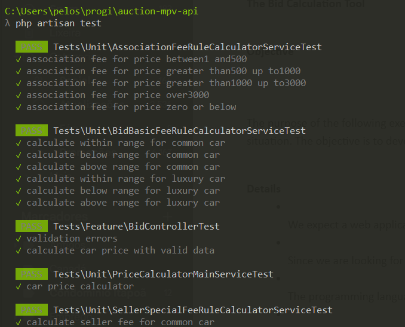

# Bid Calculator

##  How to setup?

```
git clone git@github.com:marinapelosi/auction-mvp-api.git
```

```
cd auction-mvp-api
```

```
cp .env.example .env
```

```
composer install
```

```
php artisan serve
```

## How to use?

`localhost:8000`

### POST /api/calculate-car-price

Payload:

```
{
    "price": "1000000.00",
    "type": "luxury"
}
```

| Field   | Type     | Required | Validation Rules                              | Example       |
|---------|----------|----------|-----------------------------------------------|---------------|
| price   | decimal  | Yes      | Must be numeric, minimum value of 1           | 1000000.00    |
| type    | string   | Yes      | Must be a valid string (`common` or `luxury`) | luxury        |

## Run tests

```
php artisan test
```



-----------

## Rules for Fixed and Variable Costs

### Basic buyer fee

- 10% of the price of the vehicle

#### Type of Car range of fee

- Common: minimum $10 and maximum $50
- Luxury: minimum 25$ and maximum 200$

### The seller's special fee by type of car

- Common: 2% of the vehicle price
- Luxury: 4% of the vehicle price

### The added costs for the association based on the price of the vehicle:

- $5 for an amount between $1 and $500
- $10 for an amount greater than $500 up to $1000
- $15 for an amount greater than $1000 up to $3000
- $20 for an amount over $3000

### A fixed storage fee 

- $100 for each transaction
